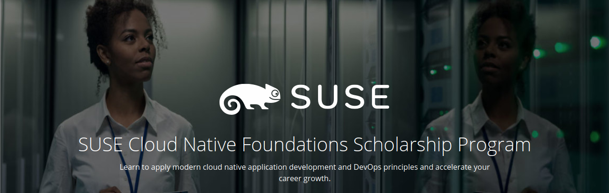

# SUSE Cloud Native Foundations Scholarship
Udacity is collaborating with SUSE, a global leader in true open source solutions, to empower developers and operations specialists to meet today's high growth career challenges. We invite students 18 years of age or older who want to build new cloud native application development, deployment, and management skills to apply to the SUSE Cloud Native Foundations Scholarship Program. 

Feeling stuck amidst the course? Feel free to refer this repository or reach out to me on Slack!

✨| Udacity SUSE Cloud Native Fundamentals Scholarship Program Nanodegree Program | Status
--- | ---| ---
1 | Introduction to Cloud Native Fundamentals |  &#9745;
2 | Architecture Consideration for Cloud Native Applications |  &#9745;
3 | Container Orchestration with Kubernetes |  &#9744;
4 | Open Source PaaS |  &#9744;
5 | CI/CD with Cloud Native Tooling |  &#9744;

## Status Definitions
 &#9744; Means that the particular Chapter is not started yet 👍  
 &#9746; Means that the particular Chapter is under progress 👨‍💻  
 &#9745; Means that the particular Chapter is completed 🎉
 
## Tools Checklist
Make sure you have setup all the required tools to get started with this course as listed [here](https://github.com/Shivansh2407/SUSE-Cloud-Native-Foundations-Scholarship/blob/main/Tools.md).
 
 ## Want to Contribute?
 Fork the repo and send PRs.
 
 Do :star: this repository to keep a track of the course. 
 
 Made with :heart: by [Shivansh](https://github.com/Shivansh2407)
 
 
